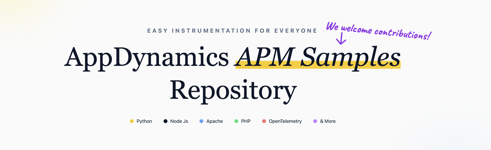

# AppDynamics Agent Samples Repository

This repository serves as a centralized collection of **AppDynamics APM agent instrumentation** examples. Each folder contains a lightweight sample application that showcases different instrumentation techniques and use cases across various AppDynamics agents.

The structure of this repository aligns with the latest [**AppDynamics official documentation**](https://help.splunk.com/en/appdynamics-saas).

> [!IMPORTANT]
> This repository is intended for reference purposes. Agent configurations and requirements may evolve with new releases. Always verify steps against the [Official AppDynamics Documentation](https://help.splunk.com/en/appdynamics-saas) before proceeding.

---

## 🛠 Contribution Guidelines

We Welcome Contributions! To keep the repository consistent, please make sure your pull requests include a readme that adheres to the standardized [template](template.md) format.

---

## Support

- For any problems related to this repository, please open an issue in the Issues section.
- If you encounter any issues with AppDynamics product, please contact Cisco AppDynamics Support by opening a TAC (Technical Assistance Center) ticket. Our engineers will assist you with troubleshooting and resolution.