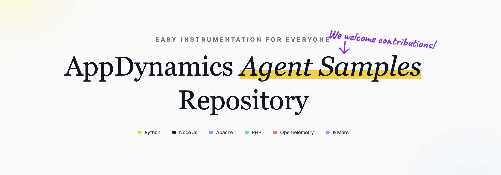

# AppDynamics Agent Samples Repository

This repository serves as a centralized collection of **AppDynamics APM agent instrumentation** examples. Each folder contains a lightweight sample application that showcases different instrumentation techniques and use cases across various AppDynamics agents.

The structure of this repository aligns with the latest [**AppDynamics official documentation**](https://help.splunk.com/en/appdynamics-saas).

> [!IMPORTANT]
> This repository is intended for reference purposes. Agent configurations and requirements may evolve with new releases. Always verify steps against the [Official AppDynamics Documentation](https://help.splunk.com/en/appdynamics-saas) before proceeding.

---

## 🛠 Contribution Guidelines

We welcome contributions! To maintain consistency across the repository, please ensure your pull requests follow the standardized template format outlined below:

---

# AppDynamics agent instrumentation type

## Overview
- Short description about the code in 2-3 bullet points

> **Note:** This repository is intended for reference purposes. Agent configurations and requirements may evolve with new releases. Always verify steps against the [Official AppDynamics Documentation](https://help.splunk.com/en/appdynamics-saas) before proceeding.

## Prerequisites

- prerequisites defined in bullet points

## Installation Method / Code Explanation

**Simple overview of the code:**

Numbered points which describe each file in short points.

**Quick Start Guide:**

- Bullet points which describe how to run the application
- Bullet points must include how to enable debug level mode & dir to see logs 
- Bullet points must include how to check if agent is runnning

## Official Documentation

- Links to some pages of the documentation page of the particular sub folder/repository

## Support

If you encounter any issues with AppDynamics product, please contact Cisco AppDynamics Support by opening a TAC (Technical Assistance Center) ticket. Our engineers will assist you with troubleshooting and resolution.